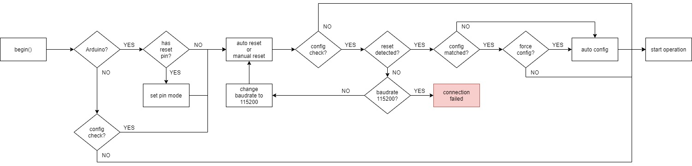

# ES920

Arduino library for ES920/ES920LR FSK/LoRa wireless module


## Requirements

- To control config / operation mode by host, RESET pin is required


## Usage

### Ascii Format

```C++
#include <ES920.h>

const uint8_t PIN_RST {2};
ES920::Config config;

// change ES920 or ES920LR here
// almost methods are common
ES920::ES920<PIN_RST> subghz;
// or
ES920::ES920LR<PIN_RST> subghz;

void setup() {
    Serial.begin(115200);
    delay(2000);

    // ES920 only
    config.rate = ES920::Rate::RATE_50KBPS;

    // ES920LR only
    config.bw = ES920::BW::BW_125_KHZ;
    config.sf = ES920::SF::SF_7;

    // common
    config.channel = ES920::ChannelRate50kbps::CH01_920_6_MHZ;
    config.panid = 0x0001;
    config.ownid = 0x0001;
    config.dstid = 0x0000;
    config.operation = ES920::Mode::OPERATION;
    config.baudrate = ES920::Baudrate::BD_115200;
    config.format = ES920::Format::ASCII;

    // set ascii format callback
    // you can add only one callback
    subghz.subscribe([](const String& str) {
        // PRINTLN is utility for ES920 library, see below for detail
        // https://github.com/hideakitai/DebugLog
        PRINTLN("subghz data received! size =", str.length());
        PRINTLN("data =", str);
    });

    // begin ES920 with your configuration
    // set required Serial here and optionally you can choose:
    // - b_config_check : check if current operation mode is matched to desired
    // - b_force_config : (optional, default = true) force to write config data if b_config_check is true
    // - b_verbose      : (optional, default = false) show verbose log to your usb-serial (Serial)

    if (subghz.begin(Serial3, config, true, true, false))
        Serial.println("begin ES920 sucess!");
    else
        Serial.println("begin ES920 failed!");

    Serial.println("start operation mode");
}

void loop() {
    subghz.parse(); // must be called to trigger callback

    // send data in one seconds
    String data = "hello, world!";
    subghz.send(data);

    delay(1000);
}
```


### Binary Format

```C++
#include <ES920.h>

const uint8_t PIN_RST {9};
ES920::Config config;

// change ES920 or ES920LR here
// almost methods are common
ES920::ES920<PIN_RST> subghz;
// or
ES920::ES920LR<PIN_RST> subghz;

void setup() {
    Serial.begin(115200);
    delay(2000);

    // ES920 only
    config.rate = ES920::Rate::RATE_50KBPS;

    // ES920LR only
    config.bw = ES920::BW::BW_125_KHZ;
    config.sf = ES920::SF::SF_7;

    // common
    config.channel = ES920::ChannelRate50kbps::CH01_920_6_MHZ;
    config.panid = 0x000`1;
    config.ownid = 0x0001;
    config.dstid = 0x0000;
    config.operation = ES920::Mode::OPERATION;
    config.baudrate = ES920::Baudrate::BD_115200;
    config.format = ES920::Format::ASCII;

    // set binary format callback and data index
    // you can add several callbacks depending on index
    subghz.subscribe(0x01, [](const uint8_t* data, const size_t size) {
        // PRINTLN is utility for ES920 library, see below for detail
        // https://github.com/hideakitai/DebugLog
        PRINTLN("subghz data received! size =", size);
        PRINT("data =");
        for (size_t i = 0; i < size; ++i)
            PRINT(data[i]);
        PRINTLN();
    });

    // begin ES920 with your configuration
    // set required Serial here and optionally you can choose:
    // - b_config_check : check if current operation mode is matched to desired
    // - b_force_config : (optional, default = true) force to write config data if b_config_check is true
    // - b_verbose      : (optional, default = false) show verbose log to your usb-serial (Serial)

    if (subghz.begin(Serial3, config, true, true, false))
        Serial.println("begin ES920 sucess!");
    else
        Serial.println("begin ES920 failed!");

    Serial.println("start operation mode");
}

void loop() {
    subghz.parse(); // must be called to trigger callback

    uint8_t data[10];
    for (uint8_t i = 0; i < 10; ++i) data[i] = i;

    subghz.send(0x02, data, sizeof(data));
    // subghz.send(0x02, data, sizeof(data), 500); // you can also wait until send will be done

    delay(1000);
}
```


### Configuration

```C++
// create config object
ES920::Config config;

// ES920 only
config.rate = ES920::Rate::RATE_50KBPS;
config.hopcount = 1;
config.endid = 0x0000;
config.route1 = 0x0001;
config.route2 = 0x0001;
config.route3 = 0x0001;

// ES920LR only
config.bw = ES920::BW::BW_125_KHZ;
config.sf = ES920::SF::SF_7;

// common
config.node = ES920::Node::ENDDEVICE;
config.channel = ES920::ChannelRate50kbps::CH01_920_6_MHZ;
config.panid = 0x0001;
config.ownid = 0x0001;
config.dstid = 0x0000;
config.ack = true;
config.retry = 3;
config.transmode = ES920::TransMode::PAYLOAD;
config.rcvid = false;
config.rssi = false;
config.operation = ES920::Mode::OPERATION;
config.baudrate = ES920::Baudrate::BD_115200;
config.sleep = ES920::SleepMode::NO_SLEEP;
config.sleeptime = 50;
config.power = 13;
config.format = ES920::Format::ASCII;
config.sendtime = 0;
config.senddata = "";
```


### Configuration Struct and Initial Values

```C++
struct Config {
    // protocol info (required for parse)
    Baudrate baudrate {Baudrate::BD_115200};
    Mode operation {Mode::CONFIG};
    Format format {Format::ASCII};
    Node node {Node::ENDDEVICE};
    TransMode transmode {TransMode::PAYLOAD};
    bool rcvid {false};
    bool rssi {false};

    // network info
    uint8_t channel {1};
    uint16_t panid {0x0001};
    uint16_t ownid {0x0001};
    uint16_t dstid {0x0000};

    // send/receive options
    bool ack {true};
    uint8_t retry {3};
    uint8_t power {13};

    // sleep configs
    SleepMode sleep {SleepMode::NO_SLEEP};
    uint32_t sleeptime {50};

    // auto send
    uint32_t sendtime {0};
    StringType senddata {""};

    // ES920 onlyh
    Rate rate {Rate::RATE_50KBPS};
    uint8_t hopcount {1};
    uint16_t endid {0x0000};
    uint16_t route1 {0x0001};
    uint16_t route2 {0x0001};
    uint16_t route3 {0x0001};

    // ES920LR only
    BW bw {BW::BW_125_KHZ};
    SF sf {SF::SF_7};
};
```


## Start-up Sequence




## Enable Debug Outputs

If you define following macro before including `ES920.h`, debug outputs will be enabled (default disabled).

```C++
#define ES920_DEBUGLOG_ENABLE
```

## APIs

### ES920/ES920LR Common

```C++
// set serial and execute auto configuration
template <typename SerialType>
bool begin(SerialType& s, const Config& cfg, const bool b_config_check, const bool b_force_config = true, const bool b_verbose = false);
// just set serial
template <typename SerialType>
void attach(SerialType& s, const Config& cfg, const bool b_verbose = false);
// change all configuration
template <typename SerialType>
bool config(SerialType& s, const Config& cfg, const bool b_verbose);

// sending data
bool send(const StringType& str, const uint32_t timeout_ms = 0);
bool send(const uint8_t* data, const uint8_t size, const uint32_t timeout_ms = 0);
bool send(const uint8_t index, const uint8_t* data, const uint8_t size, const uint32_t timeout_ms = 0);
bool send(const uint16_t pan, const uint16_t own, const StringType& str, const uint32_t timeout_ms = 0);
bool send(const uint16_t pan, const uint16_t own, const uint8_t* data, const uint8_t size, const uint32_t timeout_ms = 0);
bool send(const uint16_t pan, const uint16_t own, const uint8_t index, const uint8_t* data, const uint8_t size, const uint32_t timeout_ms = 0);

// received data management
size_t parse(const bool b_exec_cb = true);
size_t available() const;
void subscribe(const uint8_t id, const BinaryCallbackType& cb);
void subscribe(const BinaryAlwaysCallbackType& cb);
void subscribe(const AsciiCallbackType& cb);
void callback();
uint8_t index() const;
const uint8_t* data() const;
uint8_t data(const uint8_t i) const;
uint8_t size() const;
const StringType& dataString() const;
void pop();
int16_t remoteRssi() const;
const StringType& remotePanid() const;
const StringType& remoteOwnid() const;
const StringType& remoteHopid() const;
bool hasReply();
bool hasError();
const StringType& errorCode() const;
size_t errorCount() const;

// common configure commands
bool node(const Node n);
bool channel(const uint8_t ch);
bool panid(const uint16_t addr);
bool ownid(const uint16_t addr);
bool dstid(const uint16_t addr);
bool dstidBroadcast();
bool ack(const bool b);
bool retry(const uint8_t i);
bool transmode(const TransMode m);
bool rcvid(const bool b);
bool rssi(const bool b);
bool operation(const Mode m);
bool baudrate(const Baudrate b);
bool sleep(const SleepMode m);
bool sleeptime(const uint32_t ms);
bool power(const int8_t pwr);
StringType version();
bool save();
bool load();
bool start();
bool format(const Format f);
bool sendtime(const uint32_t sec);
bool senddata(const StringType& str);

// get current configuration
const Config& getConfigs() const;
Node node() const;
uint8_t channel() const;
uint16_t panid() const;
uint16_t ownid() const;
uint16_t dstid() const;
bool ack() const;
uint8_t retry() const;
TransMode transmode() const;
bool rcvid() const;
bool rssi() const;
Mode operation() const;
Baudrate baudrate() const;
SleepMode sleep() const;
uint32_t sleeptime() const;
int8_t power() const;
Format format() const;
uint32_t sendtime() const;
const StringType& senddata() const;

// for debug
void reset();
void verbose(const bool b);
bool verbose() const;
```

### ES920 only

```C++
// configuration
bool hopcount(const uint8_t i);
bool endid(const uint16_t addr);
bool route1(const uint16_t addr);
bool route2(const uint16_t addr);
bool route3(const uint16_t addr);
bool rate(const Rate r);

// get current configuration
uint8_t hopcount() const;
uint16_t endid() const;
uint16_t route1() const;
uint16_t route2() const;
uint16_t route3() const;
Rate rate() const;
```


### ES920LR only

```C++
// configuration
bool bandwidth(const BW bw);
bool spreadingfactor(const SF sf);

// get current configuration
BW bandwidth() const;
SF spreadingfactor() const;
```

## Configuration

```C++
// common

enum class Mode : uint8_t {
    CONFIG = 1,
    OPERATION
};

enum class Node : uint8_t {
    COORDINATOR = 1,
    ENDDEVICE
};

enum class TransMode : uint8_t {
    PAYLOAD = 1,
    FRAME
};

enum class Baudrate : uint8_t {
    BD_9600 = 1,
    BD_19200,
    BD_38400,
    BD_57600,
    BD_115200,
    BD_230400
};

enum class SleepMode : uint8_t {
    NO_SLEEP= 1,
    TIMER_WAKEUP,
    INT_WAKEUP
};

enum class Format : uint8_t {
    ASCII = 1,
    BINARY
};


// only for ES920

enum class Rate : uint8_t {
    RATE_50KBPS = 1,
    RATE_100KBPS
};

namespace ChannelRate50kbps {
    enum ChannelRate50kbps : uint8_t {
        CH01_920_6_MHZ = 1,
        CH02_920_8_MHZ,
        CH03_921_0_MHZ,
        CH04_921_2_MHZ,
        CH05_921_4_MHZ,
        CH06_921_6_MHZ,
        CH07_921_8_MHZ,
        CH08_922_0_MHZ,
        CH09_922_2_MHZ,
        CH10_922_4_MHZ,
        CH11_922_6_MHZ,
        CH12_922_8_MHZ,
        CH13_923_0_MHZ,
        CH14_923_2_MHZ,
        CH15_923_4_MHZ,
        CH16_923_6_MHZ,
        CH17_923_8_MHZ,
        CH18_924_0_MHZ,
        CH19_924_2_MHZ,
        CH20_924_4_MHZ,
        CH21_924_6_MHZ,
        CH22_924_8_MHZ,
        CH23_925_0_MHZ,
        CH24_925_2_MHZ,
        CH25_925_4_MHZ,
        CH26_925_6_MHZ,
        CH27_925_8_MHZ,
        CH28_926_0_MHZ,
        CH29_926_2_MHZ,
        CH30_926_4_MHZ,
        CH31_926_6_MHZ,
        CH32_926_8_MHZ,
        CH33_927_0_MHZ,
        CH34_927_2_MHZ,
        CH35_927_4_MHZ,
        CH36_927_6_MHZ,
        CH37_927_8_MHZ,
        CH38_928_0_MHZ,
    };
}

namespace ChannelRate100kbps {
    enum ChannelRate100kbps : uint8_t {
        CH01_920_7_MHZ = 1,
        CH02_921_1_MHZ,
        CH03_921_5_MHZ,
        CH04_921_9_MHZ,
        CH05_922_3_MHZ,
        CH06_922_7_MHZ,
        CH07_923_1_MHZ,
        CH08_923_5_MHZ,
        CH09_923_9_MHZ,
        CH10_924_3_MHZ,
        CH11_924_7_MHZ,
        CH12_925_1_MHZ,
        CH13_925_5_MHZ,
        CH14_925_9_MHZ,
        CH15_926_3_MHZ,
        CH16_926_7_MHZ,
        CH17_927_1_MHZ,
        CH18_927_5_MHZ,
        CH19_927_9_MHZ,
    };
}


// only for ES920LR

enum class BW : uint8_t {
    BW_62_5_KHZ = 3,
    BW_125_KHZ, // default
    BW_250_KHZ,
    BW_500_KHZ
};

enum class SF : uint8_t {
    SF_7 = 7, // default
    SF_8,
    SF_9,
    SF_10,
    SF_11,
    SF_12
};

namespace ChannelBW62_5kHz {
    enum ChannelBW62_5kHz : uint8_t {
        CH01_920_6_MHZ = 1,
        CH02_920_8_MHZ,
        CH03_921_0_MHZ,
        CH04_921_2_MHZ,
        CH05_921_4_MHZ,
        CH06_921_6_MHZ,
        CH07_921_8_MHZ,
        CH08_922_0_MHZ,
        CH09_922_2_MHZ,
        CH10_922_4_MHZ,
        CH11_922_6_MHZ,
        CH12_922_8_MHZ,
        CH13_923_0_MHZ,
        CH14_923_2_MHZ,
        CH15_923_4_MHZ,
    };
}

namespace ChannelBW125kHz {
    enum ChannelBW125kHz : uint8_t {
        CH01_920_6_MHZ = 1,
        CH02_920_8_MHZ,
        CH03_921_0_MHZ,
        CH04_921_2_MHZ,
        CH05_921_4_MHZ,
        CH06_921_6_MHZ,
        CH07_921_8_MHZ,
        CH08_922_0_MHZ,
        CH09_922_2_MHZ,
        CH10_922_4_MHZ,
        CH11_922_6_MHZ,
        CH12_922_8_MHZ,
        CH13_923_0_MHZ,
        CH14_923_2_MHZ,
        CH15_923_4_MHZ,
    };
}

namespace ChennelBW250kHz {
    enum ChannelBW250kHz : uint8_t {
        CH01_920_7_MHZ = 1,
        CH02_921_1_MHZ,
        CH03_921_5_MHZ,
        CH04_921_9_MHZ,
        CH05_922_3_MHZ,
        CH06_922_7_MHZ,
        CH07_923_1_MHZ,
    };
}

namespace ChannelBW500kHz {
    enum ChannelBW500kHz : uint8_t {
        CH01_920_8_MHZ = 1,
        CH02_921_4_MHZ,
        CH03_922_0_MHZ,
        CH04_922_6_MHZ,
        CH05_923_2_MHZ,
    };
}
```

## Embedded Libraries

- [ArxStringUtils v0.2.10](https://github.com/hideakitai/ArxStringUtils)
- [DebugLog v0.6.6](https://github.com/hideakitai/DebugLog)
- [Packetizer v0.7.0](https://github.com/hideakitai/Packetizer)
- [TeensyDirtySTLErrorSolution v0.1.0](https://github.com/hideakitai/TeensyDirtySTLErrorSolution)


## License

MIT
